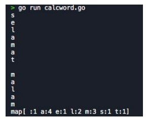

# BATCH 7 Challenges day 3

SOAL :

1. Buatlah looping dengan variable yang berisi string suatu kalimat dan pecahlah kalimat tersebut menjadi 1 per 1 kata
   Setelah sudah dipecah lakukan perhitungan munculnya kata dari variable tersebut dengan cara mapping
   golang
   Contoh Output dapat dilihat pada gambar yang di attach :
   Input : “selamat malam”

EXPENTASION OUTPUT

